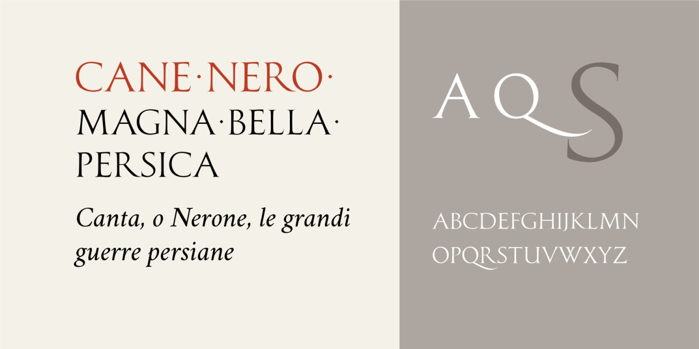

# Cane Nero
* Versione 1.0: versione iniziale

Per testare il font, vedere la [pagina interattiva](https://m-casanova.github.io/CaneNero/).

## Descrizione

_Cane Nero_ è un font di test ispirato a iscrizioni romane.

Sono presenti alcune legature ('dlig') e la possibilità di sostituire /U con /V ('ss01').
